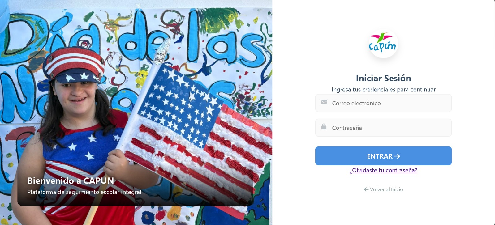
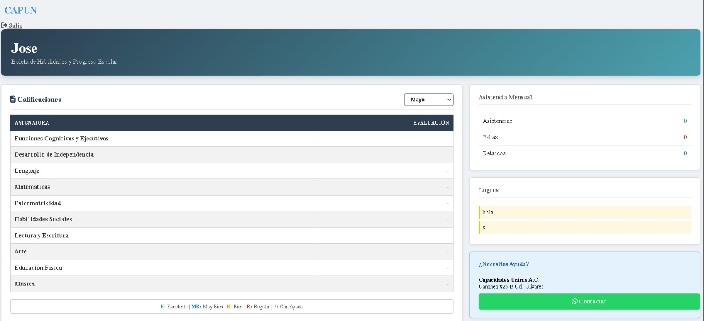
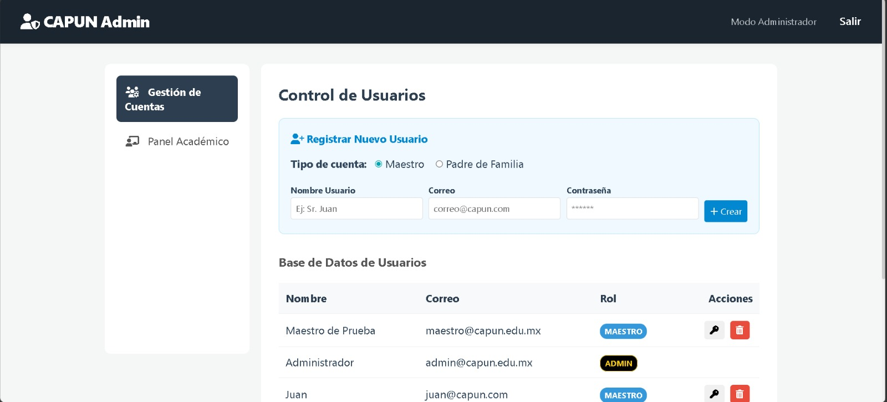
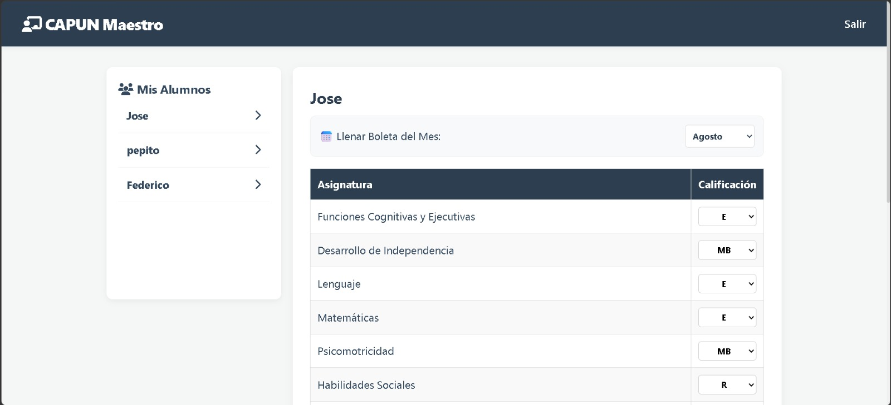

> 🌐 **Read this in:** **English** · [Español](./README.md)

<div align="center">

# CAPUN — School Progress Tracking Platform


**Full-stack web platform for CAPUN — Centro de Atención Psicopedagógica (Capacidades Únicas A.C.), Hermosillo, México.**

</div>

---

## 📖 About the project

**CAPUN — Centro de Atención Psicopedagógica (Capacidades Únicas A.C.)** is a non-profit organization based in Hermosillo, Sonora, México, that provides psycho-educational and therapeutic services to children and young people with intellectual disabilities. A dedicated team of therapists works with each student every day to support their cognitive, linguistic, motor, and social development.

### The problem

Before this system, all student information — grades, attendance, achievements, and communications — was managed on paper and scattered across physical files. This made it hard to track individual cases, communicate with families, and help the teaching staff make informed decisions.

### The solution

This platform fully digitalizes CAPUN's student record management. It serves two distinct user profiles with independent interfaces:

- **Parents:** check their child's monthly report card, attendance history, recorded achievements, and staff communications at any time, from any device.
- **Staff (therapists and administrators):** enter grades and attendance per student, log achievements, manage user accounts, and communicate directly with families through the built-in messaging system.

> **Context:** This project was built as a *service learning* initiative — a university-required community service program in México where students contribute professional work to civil society organizations at no cost.

---

## 🔗 Live demo

| Component | URL |
|---|---|
| Frontend | [capunservicio-gif.github.io/capun-web](https://capunservicio-gif.github.io/capun-web/index.html) |
| Backend API | [capun-api.onrender.com](https://capun-api.onrender.com) |

> **Note:** The backend runs on Render's free tier. If it has been idle, the first request may take ~30 seconds to respond.

---

## 📸 Screenshots

| Login | Parent Dashboard | Admin Panel |
|---|---|---|
|  |  |  |

| Teacher Panel |
|---|
|  |

---

## 🏗️ Architecture

```
┌─────────────────────────────┐        HTTPS / REST API
│   FRONTEND (GitHub Pages)   │ ──────────────────────────────►  ┌──────────────────────────┐
│                             │                                   │   BACKEND (Render)       │
│  HTML5 · CSS3 · Vanilla JS  │ ◄──────────────────────────────  │                          │
│                             │        JSON Responses             │  Node.js · Express · JWT │
│  • Landing page             │                                   │                          │
│  • Parent portal            │                                   └──────────────┬───────────┘
│  • Teacher panel            │                                                  │ Mongoose ODM
│  • Admin panel              │                                                  │
└─────────────────────────────┘                                   ┌──────────────▼───────────┐
                                                                   │   MongoDB Atlas (Cloud)  │
                                                                   │                          │
                                                                   │  users · children        │
                                                                   │  messages · events       │
                                                                   └──────────────────────────┘
```

**Authentication flow:** the user logs in from the frontend → the backend validates credentials and issues a signed **JWT** → the token is stored in `localStorage` → all subsequent requests include the token in the `Authorization` header → the backend verifies the token and role before processing each request.

---

## 🛠️ Tech stack

| Layer | Technology | Purpose |
|---|---|---|
| Frontend | HTML5 | Semantic view structure |
| Frontend | CSS3 (Variables + Flexbox + Grid) | Responsive styles and design system |
| Frontend | JavaScript ES6+ (Vanilla) | Client logic, fetch API, DOM handling |
| Backend | Node.js 20.x | Server runtime |
| Backend | Express 4.18 | HTTP framework and routing |
| Backend | JSON Web Tokens (JWT) | Stateless authentication and role control |
| Backend | bcryptjs | Secure password hashing |
| Backend | Nodemailer | Email delivery for password recovery |
| Backend | dotenv | Environment variable management |
| Backend | cors | Cross-origin access control |
| Database | MongoDB Atlas | Cloud NoSQL database |
| Database | Mongoose 8 | ODM for document modeling and validation |
| Frontend deploy | GitHub Pages | Free static hosting |
| Backend deploy | Render | Node.js server hosting |
| Version control | Git / GitHub | Source control and remote repository |

---

## ✨ Features

### 👨‍👩‍👧 Parent Portal

- View the child's **monthly report card** with grades per subject area (Language, Math, Psychomotricity, Social Skills, and 6 more)
- Check **monthly attendance stats** (days attended, absences, tardies)
- Browse the **achievement log** recorded by the therapy team
- Access the portal from any device — fully responsive design
- **Password recovery** via email

### 🏫 Administrative Module (Teachers and Admin)

**Teacher Panel:**
- View the full student roster
- Enter and update grades per student and month
- Record attendance stats
- Add and remove individual achievements
- Send messages to parents

**Admin Panel** (full access):
- Create accounts for parents, teachers, and administrators
- Reset any user's password
- Delete users and their associated records
- View and edit academic records
- Manage the announcements and events board
- Access the full internal messaging inbox

---

## 📁 Project structure

```
CAPUN/                          ← Monorepo root
│
├── frontend/                   ← Client application (GitHub Pages)
│   ├── assets/                 ← Institutional images and logo
│   ├── js/
│   │   ├── app.js              ← Parent portal logic
│   │   └── login.js            ← Authentication and role-based redirect
│   ├── pages/
│   │   ├── login.html          ← Login screen
│   │   ├── admin.html          ← Admin panel
│   │   ├── teacher.html        ← Teacher panel
│   │   ├── forgot-password.html
│   │   └── reset-password.html
│   ├── index.html              ← Institutional landing page
│   ├── dashboard.html          ← Parent portal
│   └── style.css               ← Global styles
│
├── backend/                    ← REST API (Render)
│   ├── controllers/
│   │   └── passwordController.js   ← Password recovery logic
│   ├── middleware/
│   │   └── auth.js             ← JWT token verification
│   ├── models/
│   │   ├── User.js             ← User model
│   │   ├── Child.js            ← Student model (report card, attendance, achievements)
│   │   ├── Message.js          ← Messaging model
│   │   └── Event.js            ← Events/announcements model
│   ├── routes/
│   │   ├── auth.js             ← Extended authentication routes
│   │   └── passwordRoutes.js   ← Password recovery routes
│   ├── server.js               ← Main entry point
│   ├── .env.example            ← Environment variables template
│   └── package.json
│
├── docs/
│   └── img/                    ← Screenshots (README)
├── .gitignore
├── README.md
└── README.en.md
```

---

## ⚙️ Local setup

### Prerequisites

- [Node.js v18+](https://nodejs.org/) and npm
- A [MongoDB Atlas](https://www.mongodb.com/atlas) account (free tier available)
- A static file server: [Live Server](https://marketplace.visualstudio.com/items?itemName=ritwickdey.LiveServer) (VS Code) or `npx serve`

### 1. Clone the repo

```bash
git clone https://github.com/MiguelC121913/CAPUN.git
cd CAPUN
```

### 2. Configure the backend

```bash
cd backend
npm install
```

Copy the example file and fill in your values:

```bash
cp .env.example .env
```

Open `.env` and set each variable:

```env
MONGO_URI=mongodb+srv://<user>:<password>@<cluster>.mongodb.net/<db-name>
JWT_SECRET=a_long_random_string
PORT=3000
NODE_ENV=development
FRONTEND_URL=http://localhost:5500
EMAIL_USER=your_email@gmail.com
EMAIL_PASS=your_gmail_app_password
```

> For `EMAIL_PASS`, you need a **Google App Password** (not your regular account password). Generate one at: Google Account → Security → 2-Step Verification → App passwords.

### 3. Start the backend

```bash
node server.js
# Or with auto-reload:
npm run dev
```

The server will be available at `http://localhost:3000`. You should see in the console:

```
✅ MongoDB conectado
🚀 Servidor CAPUN corriendo en http://localhost:3000
```

> *Note: The server's console output is in Spanish, matching the application's primary user language.*

### 4. Serve the frontend

From the project root, open `frontend/index.html` with Live Server (port 5500) or:

```bash
npx serve frontend -p 5500
```

Navigate to `http://localhost:5500` to see the landing page.

---

## 🔌 API endpoints

> Base URL: `https://capun-api.onrender.com` (production) · `http://localhost:3000` (local)

### Authentication

| Method | Route | Description | Auth required |
|---|---|---|---|
| `POST` | `/api/register` | Register a new user | No |
| `POST` | `/api/login` | Log in — returns a JWT | No |
| `POST` | `/api/password/forgot-password` | Request a password recovery email | No |
| `POST` | `/api/password/reset-password` | Reset password using the recovery token | No |

### Parent Portal

| Method | Route | Description | Auth required |
|---|---|---|---|
| `GET` | `/api/my-child-data` | Get the child's full record | ✅ JWT |
| `GET` | `/api/messages` | View the calling user's message inbox | ✅ JWT |
| `POST` | `/api/messages` | Send a message to the team | ✅ JWT |
| `GET` | `/api/events` | View announcements and events | ✅ JWT |

### Teacher Panel

| Method | Route | Description | Auth required |
|---|---|---|---|
| `GET` | `/api/teacher/students` | List all students | ✅ JWT |
| `PUT` | `/api/teacher/students/:id/boleta` | Update a student's monthly report card and attendance | ✅ JWT (teacher/admin) |
| `POST` | `/api/teacher/students/:id/achievement` | Add an achievement to a student | ✅ JWT |
| `DELETE` | `/api/teacher/students/:id/achievement/:itemId` | Remove an achievement | ✅ JWT |
| `GET` | `/api/teacher/messages` | View the full messaging inbox | ✅ JWT |
| `POST` | `/api/events` | Create an announcement or event | ✅ JWT |
| `DELETE` | `/api/events/:id` | Delete an announcement | ✅ JWT |

### Admin Panel

| Method | Route | Description | Auth required |
|---|---|---|---|
| `GET` | `/api/admin/users` | List all user accounts | ✅ JWT (admin) |
| `POST` | `/api/admin/users` | Create a user (any role) | ✅ JWT (admin) |
| `PUT` | `/api/admin/users/:id/reset-password` | Reset a user's password | ✅ JWT (admin) |
| `DELETE` | `/api/admin/users/:id` | Delete a user and their records | ✅ JWT (admin) |

---

## 🗃️ Data models

### `User` — User accounts

| Field | Type | Description |
|---|---|---|
| `name` | String | Full name |
| `email` | String (unique) | Email address — login identifier |
| `password` | String | bcrypt hash of the password |
| `role` | Enum | `admin` · `teacher` · `parent` |
| `isActive` | Boolean | Account status |
| `lastLogin` | Date | Timestamp of the last login |
| `resetPasswordToken` | String | Temporary token for password recovery |
| `resetPasswordExpires` | Date | Expiration date for the recovery token |

### `Child` — Student record

| Field | Type | Description |
|---|---|---|
| `parentId` | ObjectId (ref: User) | Linked parent account |
| `name` | String | Student name |
| `generalStatus` | String | Overall cycle status (e.g. "En proceso") |
| `boleta.grades` | Object | Grades per month and subject |
| `boleta.attendanceStats` | Object | Attendance, absences, and tardies per month |
| `achievements` | Array | Achievement log with title and date |

### `Message` — Internal messaging

| Field | Type | Description |
|---|---|---|
| `from` | ObjectId (ref: User) | Sender |
| `toUser` | ObjectId (ref: User) | Specific recipient (optional) |
| `toRole` | Enum | Target role: `admin` · `teacher` · `parent` |
| `content` | String | Message body |
| `date` | Date | Sent timestamp |
| `read` | Boolean | Read status |

### `Event` — Announcements and events

| Field | Type | Description |
|---|---|---|
| `title` | String | Announcement or event title |
| `date` | Date | Date the event takes place |
| `description` | String | Extended description (optional) |
| `createdBy` | ObjectId (ref: User) | User who created it (admin or teacher) |

---

## 🔒 Security

- **JWT authentication:** each session issues a token signed with `JWT_SECRET` (set via environment variables) that expires after 24 hours. The server rejects any request with a missing or invalid token.
- **Environment variables:** all sensitive credentials (MongoDB URI, JWT secret, email credentials) are managed in `.env`, excluded from the repository via `.gitignore`.
- **Role-based authorization:** three access levels (`admin`, `teacher`, `parent`). The backend verifies the role on every protected endpoint before executing any operation.
- **Password hashing:** passwords are never stored in plain text — they are hashed with `bcryptjs` using a salt of 10 rounds.
- **CORS policy:** the API only accepts requests from the origins declared in `FRONTEND_URL` and `localhost:5500`. Any unauthorized domain is rejected.

---

## 🗺️ Roadmap

- Migrate the frontend to a modern framework (Angular or React) for better maintainability and scalability
- Automated testing: Jest for the backend, Playwright for the frontend
- Push notifications to parents for new announcements, grades, or messages
- Aggregate metrics dashboard for administrators (average attendance, students per area, etc.)
- Internationalization (ES/EN) to reach bilingual families
- Offline mode with sync for areas with unstable connectivity

---

## 📞 Contact

**Miguel Ángel Córdova Salcido** — Full-Stack Developer

[](https://www.linkedin.com/in/miguel-angel-córdova/)
[](https://github.com/MiguelC121913)
[](mailto:miguelcordova111@gmail.com)

---

## 📄 License

This project is licensed under the **MIT License**. See the [LICENSE](./LICENSE) file for details.
